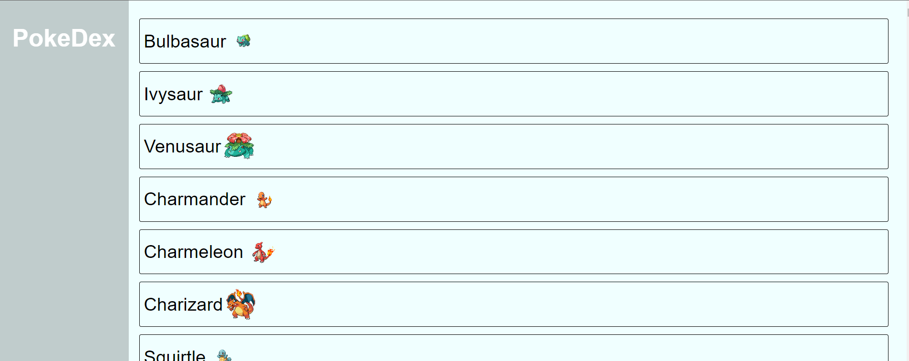

# PokeDex

Explore e descubra todos os Pokémon da saga através desta aplicação interativa.



## Como iniciar a aplicação

Siga os passos abaixo para executar o projeto localmente:

1. **Instalar dependências**:  
   Na pasta raiz do projeto, execute o comando:
   ```bash
   npm install
   ```
   Isso instalará todas as dependências necessárias para o funcionamento da aplicação.

2. **Iniciar o servidor**:  
   Ainda na pasta raiz `/Pokedex-API`, execute o comando:
   ```bash
   npm start
   ```
   O servidor será iniciado e estará disponível no endereço:
   ```
   http://localhost:3000/
   ```


# PokeDex-API
